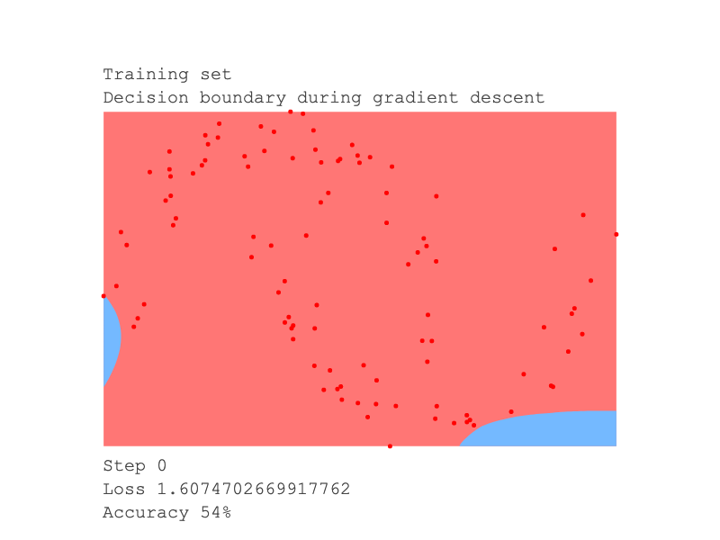
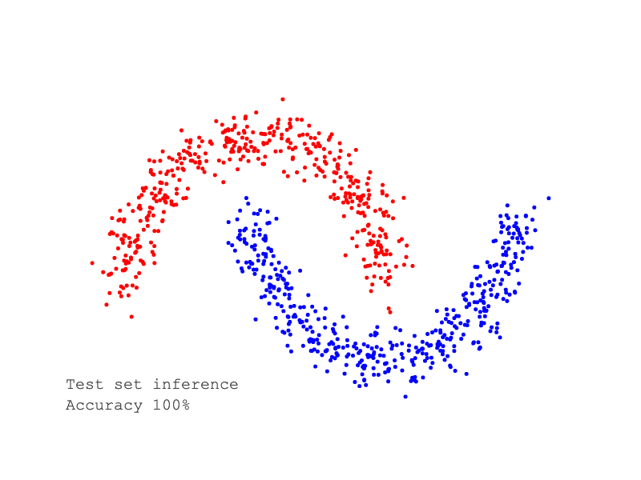

# NN
Simple autograd engine implementing backpropagation and an MLP neural network library built on it.
Heavily inspired by [micrograd](https://github.com/karpathy/micrograd) and 
[PyTorch autograd](https://pytorch.org/tutorials/beginner/blitz/autograd_tutorial.html).

The [main.rs](src/main.rs) file shows an example performing
binary classification on the make_moons dataset.

## Training
The model is trained on 100 points of the make_moons dataset.
Here's a visualization of how the decision boundary evolves during gradient descent:


## Testing
After training, the model is tested on the remaining data and achieves 100% accuracy.
Below is a plot showing the correctly classified data points:


## Run
`cargo run` 
```
> cargo run
Training set gradient descent
Step 0, loss: 1.6074702669917762, accuracy: 54%
Step 1, loss: 1.7333523672032618, accuracy: 47%
...
Step 98, loss: 0.011572048264185729, accuracy: 100%
Step 99, loss: 0.011518733035234319, accuracy: 100%
---------------------------------------------------
Test set inference
Accuracy: 100%
```

## Output plots
`cargo run -- --plot && magick -delay 40 -loop 0 decision-boundary-*.png decision-boundary.gif`
